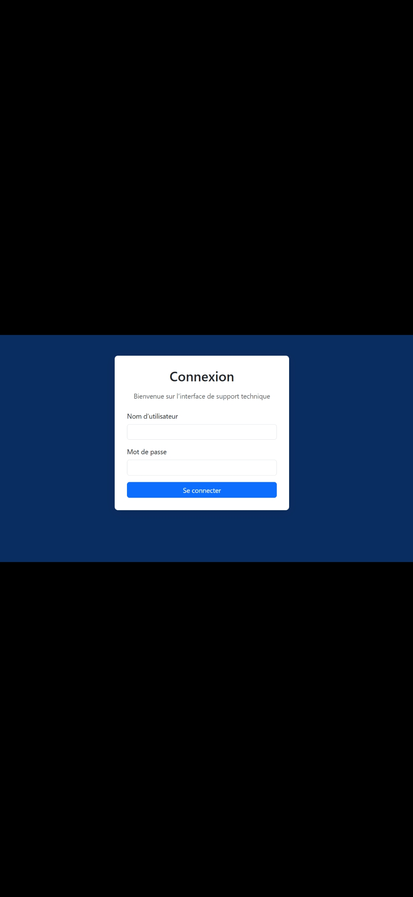
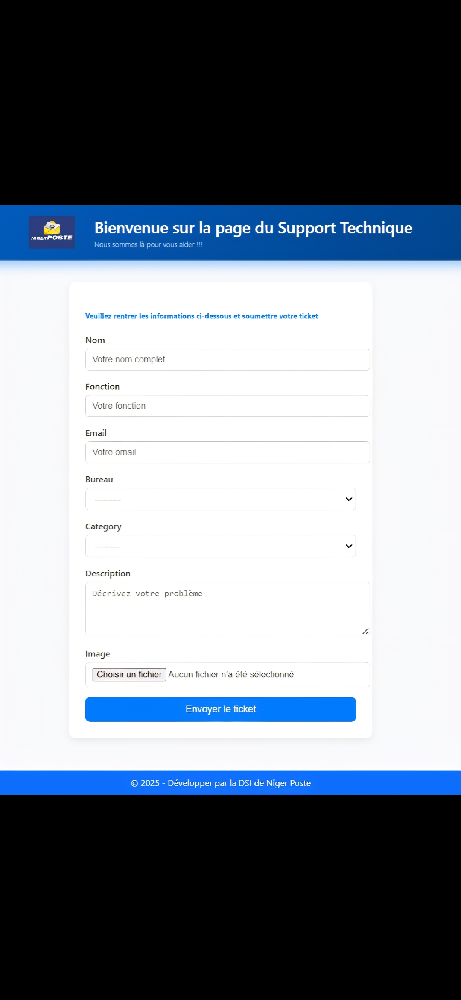
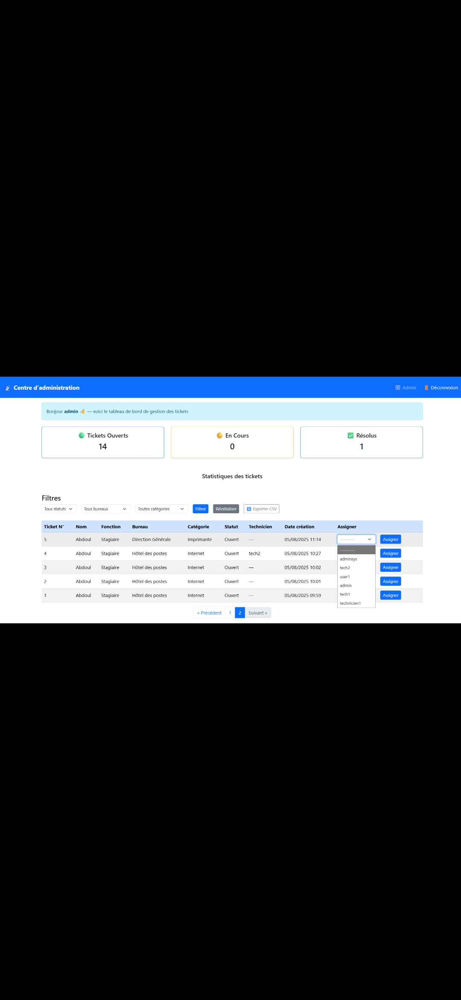
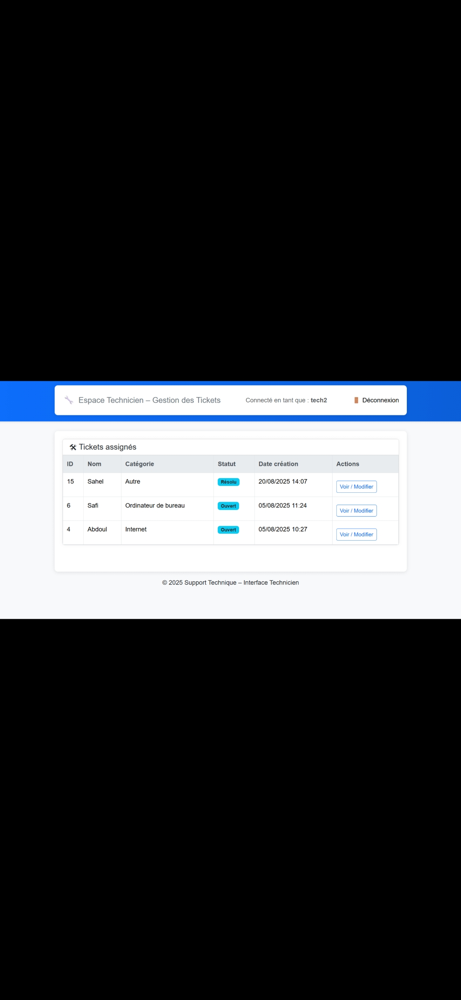

Portfolio – Abdoul Maliki 

### Projet 1 : Application de ticketing interne

Technologies : Python/Django, PostgreSQL, Linux  
Objectif : Faciliter le suivi et la gestion des incidents IT.  
Rôle : Développement complet, interface web, base de données, notifications email.

---

### Capture 1: Page de login
  

Description : Pour la sécurité du service il est nécessaire d'avoir des identifiants pour pouvoir y accéder. Cette page s'occupe également des redirections intelligente, ainsi en fonction des rôles elle redirige les utilisateurs vers la page de formulaire. Les techniciens vers celle des techniciens et les administrateurs vers celle des administrateurs.

### Capture 2 : Création d’un ticket
  

Description : L’utilisateur peut créer un ticket avec un titre, une catégorie et notamment pour parler du niveau de priorité et les besoins. Le formulaire est simple, responsive et intuitif pour permettre une saisie rapide des incidents. 

---

### Capture 3 : Dashboard administrateur
  

Description : Vue d’ensemble pour les administrateurs, avec suivi des tickets en temps réel. Les tickets sont triés par statut (ouvert, en cours, résolu) pour faciliter le traitement. Ils ont notamment la possibilité d'assigner un ticket à un technicien spécifique tout comme à un groupe de techniciens. Ils peuvent également trier les tickets et exporter un fichier pour les statistiques d’incidents mensuelles ou annuelles.

---

### Capture 4 : Dashboard technicien 
  

Description : Les techniciens reçoivent uniquement le ticket qui leur est affecté. Ils n'ont pas la possibilité de voir les tickets assigner à un autre technicien sauf si le ticket a été assigné au groupe de techniciens auquel il fait parti.

---

### Capture 5 : Détails du tickets
  

Description :Chaque ticket créé ou mis à jour déclenche l’envoi automatique d’un email aux parties concernées, pour assurer un suivi efficace. Sur sa page les tickets apparaîtront sous forme de liste et le technicien peut ainsi consulter les tickets en cliquant dessus pour avoir plus de détails.

---

 Bénéfices du projet
- Suivi centralisé des incidents IT  
- Notifications automatiques pour ne rien oublier  
- Interface web simple et intuitive  
- Démonstration des compétences en développement Django, administration de base de données et sécurité minimale des accès.

---

Note : Les captures d’écran sont fournies à titre illustratif. Le code source complet pour une démo est disponible sur demande.

### Projet 2 : Mise en place d'un contrôleur de domaine avec Samba 4

**Technologies :** Samba 4, Linux, Windows clients, WinRM, Ansible  

**Objectif :** Fournir une infrastructure Active Directory interne pour gérer utilisateurs, groupes, et appliquer des stratégies de sécurité aux postes Windows tout en automatisant la gestion.  

**Rôle :**
- Configuration du serveur Samba 4 en tant que contrôleur de domaine  
- Création et gestion des utilisateurs et groupes  
- Déploiement de stratégies de groupe (GPO) via les outils Windows (RSAT / GPMC)  
- Automatisation de la configuration et déploiement de logiciels sur les postes Windows avec WinRM et Ansible.

## Topologie AD Samba 4 (schéma simplifié)

[Administrateur]
      |
      v
+-----------------+
| Serveur Samba 4 |
| Contrôleur AD   |
+-----------------+
     |       |
     v       v
   [PC1]    [PC2]

**Détails techniques:**
- Le serveur Samba 4 agit comme contrôleur de domaine, gérant authentification et permissions des utilisateurs Windows.  
- Les GPO sont déployées via les outils Windows pour appliquer les politiques de sécurité et configurations logicielles sur les postes clients.  
- L’accès distant et l’automatisation sont assurés par WinRM et Ansible, pour une meilleure maîtrise de la gestion à grande échelle et sécurisée des postes.  
- Le schéma illustre le flux centralisé de gestion et sécurité, avec la possibilité d’automatisation complète pour l’administrateur.  

**Bénéfices :**
- Gestion centralisée et sécurisée des utilisateurs et postes  
- Déploiement automatisé et maintenance simplifiée  
- Nouvelles aptitudes en administration AD, Linux, et automatisation  

---

### Projet 3 : Gestion des serveurs de messagerie avec Postfix

**Technologies :** Postfix, Dovecot, Roundcube, Linux  

**Objectif :** Fournir un service de messagerie interne sécurisé pour les utilisateurs.  

**Rôle :**
- Installation et configuration de Postfix pour l’envoi et la réception des emails  
- Configuration de Dovecot pour la récupération sécurisée des emails  
- Mise en place de Roundcube pour l’accès webmail  
- Gestion des utilisateurs et des droits d’accès  

## Flux de messagerie Postfix (schéma simplifié)

[Utilisateur 1] ----\
                     \
                      --> [Serveur Postfix + Dovecot] --> [Roundcube Webmail]
[Utilisateur 2] ----/

**Fonctionnement et flux :** 
- Le serveur gère l’envoi et la réception des emails pour tous les utilisateurs.  
- Dovecot permet la récupération sécurisée des emails, et Roundcube offre un accès webmail simple pour les utilisateurs.  
- Le schéma illustre le flux centralisé de messagerie et la gestion des utilisateurs.  
- Même simplifié, il montre que je maîtrise la configuration et la sécurité des services de messagerie Linux.  

**Bénéfices :**
- Messagerie interne fonctionnelle et sécurisée  
- Gestion simple des comptes utilisateurs  
- Démonstration de compétences en administration de serveurs Linux et services email
